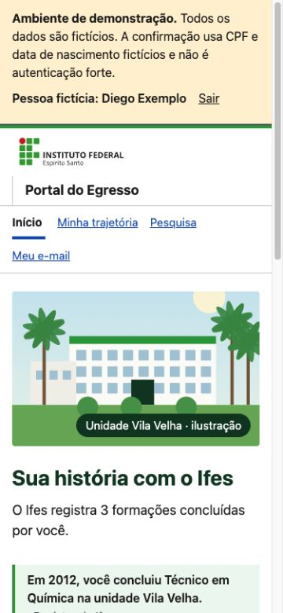

# Portal do Egresso — avaliação técnica exploratória

Data: 2026-10-08. Avaliação por agente, navegando na demonstração local. Não é sessão
com egresso, não atribui notas aos critérios SC-008 a SC-016 e não conclui o Checkpoint 1.

## Resultado e limites

O percurso observado permite entrar pelo Portal, consultar registros e acessar a
trajetória, a prévia do card, o formulário de e-mail e a escolha de pesquisas sem
responder a um questionário. Não foi observado bloqueio nesse percurso com Maria.
Isso comprova a disponibilidade das ações observadas, não a compreensão dos egressos.

O desenvolvimento pode continuar em correções e melhorias da etapa atual. A espera
por resultados antes de S2/S3 é uma decisão explícita do
[protocolo](../../specs/024-inicio-egresso-portal/evidencias/protocolo-checkpoint-1.md),
não uma impossibilidade técnica. Antecipar essas etapas exige revisar explicitamente
o plano; esta avaliação não substitui a evidência prevista no Checkpoint 1.

## Ambiente e método

- Servidor já ativo em `http://127.0.0.1:8000/`, sem recriar banco ou chaves.
- Worktree do servidor: `.claude/worktrees/agitated-chebyshev-d2c86b`, baseado no
  commit `3653886`, com alterações locais na spec, no teste e no CSS da 021 para a
  correção de rolagem informada pelo solicitante. Essas alterações não foram editadas.
- Chrome; viewports de 375×812 e 320×812. Fonte sem ampliação nesta avaliação.
- Uso apenas das personas fictícias do painel da demonstração.
- Inspeção visual, árvore de acessibilidade, medidas de elementos e uma verificação
  pontual do foco de teclado. Não foi usado VoiceOver ou NVDA.
- Não foram enviados e-mails nem respostas de pesquisa. O formulário de contato foi
  aberto, mas não salvo. Não foi realizado download do card; a prévia carregou.
- Não foi executada a suíte de testes nesta avaliação de navegação; o código da
  aplicação não foi alterado.

## Observações verificadas

| Percurso ou elemento | Evidência observada |
|---|---|
| Entrada pela raiz | Sem sessão, `/` levou a `/entrar/`; o botão da persona Maria levou a `/inicio/` |
| Reconhecimento | Ana, Maria e Diego exibiram respectivamente 1, 2 e 3 formações. As formações aparecem antes das ações e do convite |
| Proveniência | O Início identifica `Registro do Ifes`, derivados calculados e afirma que aquelas informações não foram respondidas pelo participante |
| Trajetória de Maria | A navegação abriu `/minha-trajetoria/`; a imagem do card carregou, com largura natural de 1080 px |
| E-mail de Maria | `Meu e-mail` abriu o formulário, com finalidade de convites à pesquisa, caráter opcional e aviso de texto provisório |
| Pesquisa de Maria | `Pesquisa` abriu as duas formações, ambas com opção de iniciar e informação de no máximo 9 partes |
| Tela estreita | A 320 px, Início e Minha trajetória de Maria tiveram `scrollWidth = clientWidth = 305 px`; o espaço restante corresponde à barra de rolagem |
| Navegação | Os quatro links do Início mediram 44 px de altura; o item atual usa `aria-current="page"` |
| Teclado | Tab a partir de `Pular para o conteúdo` levou a `Sair`, com contorno sólido de 3 px |
| Saída | `Sair` levou a `/acesso/`, cuja apresentação é centrada na pesquisa |
| Persona sem formação | João recebeu mensagem genérica de não confirmação e opções de conferir os dados ou informar formação. Não foi testado o envio da declaração |
| Vídeo | Não havia opção de vídeo nas telas observadas. Geração e reprodução não foram verificadas |

## Hipóteses para observar com egressos

Estas são perguntas de revisão, não falhas demonstradas por participantes:

1. **Continuidade do ambiente.** O cabeçalho muda de `Portal do Egresso` no Início
   para `Trajetória Ifes` nas outras páginas. Essa escolha está prevista em FR-024
   da 024. Observar se a pessoa entende que continua no mesmo ambiente.
2. **Vocabulário da imagem.** A interface usa `card`, enquanto SC-015 também emprega
   `Retrato`. Observar se a pessoa encontra a imagem a partir da tarefa aberta,
   sem ensiná-la a palavra usada pelo produto.
3. **Reentrada depois de sair.** O retorno a `/acesso/` está previsto no
   [contrato de rotas](../../specs/024-inicio-egresso-portal/contracts/rotas.md).
   Observar se a mudança para uma entrada centrada na pesquisa enfraquece a
   compreensão de espaço de relacionamento. Eventual mudança precisa revisar a spec.

## Próximo trabalho

Executar a verificação real com leitor de tela (P4) e registrar os obstáculos
observados. Em paralelo, resolver P1/P2/P3 para as sessões. Não marcar a compreensão
como aprovada a partir desta inspeção. A retomada de S2/S3 segue o protocolo vigente,
salvo revisão explícita do plano pelo solicitante.

